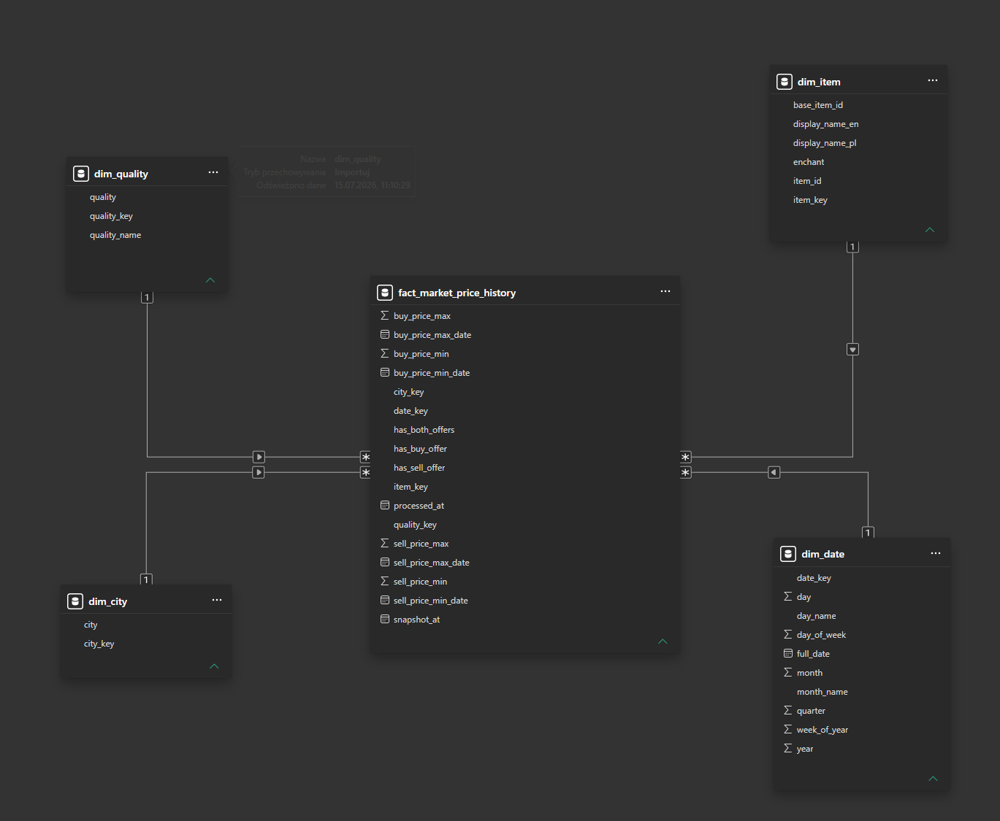
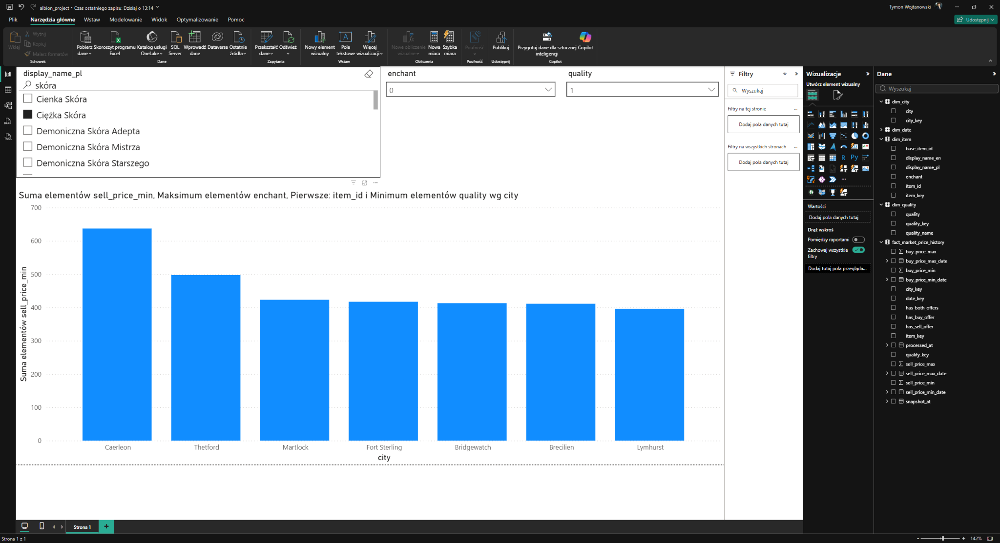

# Albion Online Market Prices Data Pipeline

End-to-end data engineering project for collecting, processing, modelling, and exposing Albion Online market price data for analytical consumption.

The project extracts market data from the Albion Online Data API using Python, stores the extracted datasets in Parquet format, processes them in Databricks using a Bronze / Silver / Gold medallion architecture, builds a dimensional star schema, and exposes the final model to Power BI.

The main focus of the project is the data engineering pipeline rather than the BI layer.

---

## Architecture

```text
Albion Online Data API
        |
        v
Python Extraction
        |
        v
Parquet Files
        |
        v
Databricks
        |
        +--> Bronze Layer
        |
        +--> Silver Layer
        |
        +--> Gold Layer
                |
                v
           Star Schema
                |
                v
            Power BI
```

The solution separates data extraction, storage, transformation, modelling, and consumption into clearly defined stages.

---

## Technologies

The project uses:

- Python
- Pandas
- Requests
- JSON
- Parquet
- PySpark
- Apache Spark
- Databricks
- Delta Lake
- Unity Catalog
- Git
- GitHub
- Power BI

---

## Data Sources

The project uses two main types of data.

### Market Price Data

Market prices are retrieved from the Albion Online Data API.

Each API response contains market information for combinations of:

- item
- city
- quality
- buy price
- sell price
- source price timestamps

The API uses technical item identifiers rather than human-readable in-game names.

Example:

```text
T4_DUALSCIMITAR_UNDEAD
```

instead of:

```text
Galatine Pair
```

### Item Metadata

A separate `items.json` source is used to create item metadata.

It contains information such as:

- technical item identifier
- English item name
- Polish item name

This metadata is processed separately and later joined with the analytical item dimension.

---

## Python Data Extraction

Market extraction is performed locally using Python.

The API accepts item identifiers as part of the request URL. Because querying all item identifiers in a single request would exceed practical URL length limits, the extraction script dynamically divides item identifiers into batches.

The batching logic:

1. Reads all item identifiers from `items.json`.
2. Builds a candidate request URL.
3. Checks the total URL length.
4. Starts a new batch when the configured maximum URL size would be exceeded.
5. Executes one API request per batch.
6. Combines all responses into a single dataset.

The extracted API responses are collected into a Pandas DataFrame.

A `snapshot_at` timestamp is added to the dataset to identify when the complete market snapshot was collected.

Example:

```text
snapshot_at = 2026-07-13 13:00:00 UTC
```

The final dataset is stored using the Parquet format.

Parquet was selected because it provides:

- columnar storage
- compression
- efficient analytical reads
- native integration with Spark and Databricks

---

## Item Metadata Extraction

A second Python script extracts item metadata from `items.json`.

The generated dataset contains:

```text
item_id
item_name_en
item_name_pl
```

Example:

```text
item_id                       item_name_en
T4_DUALSCIMITAR_UNDEAD        Galatine Pair
```

The item metadata is also stored as Parquet and ingested independently from market prices.

Keeping item metadata separate from market facts avoids unnecessarily repeating descriptive item information across every market observation.

---

## Medallion Architecture

The Databricks part of the project follows the Bronze / Silver / Gold architecture.

```text
Raw Parquet
     |
     v
   Bronze
     |
     v
   Silver
     |
     v
    Gold
```

Each layer has a different responsibility.

---

# Bronze Layer

The Bronze layer contains data close to its original source representation.

Main tables:

```text
albion_project.bronze.prices
albion_project.bronze.items
```

The purpose of Bronze is to preserve the source datasets before applying business transformations.

The market Parquet file is loaded using Spark and stored as a Delta table.

The item metadata dataset follows the same ingestion pattern.

Bronze therefore acts as the raw persistence layer of the Databricks pipeline.

---

# Silver Layer

The Silver layer performs cleaning, standardisation, validation, and business-oriented transformations.

Main tables:

```text
albion_project.silver.prices
albion_project.silver.items
```

## Market Data Transformations

The market dataset contains several technical values that require interpretation before analytical use.

### Buy and Sell Offer Flags

Two flags are created:

```text
has_sell_offer
has_buy_offer
```

An active sell offer exists when valid sell prices are present.

An active buy offer exists when valid buy prices are present.

The source API frequently represents missing market offers using technical zero values.

These values are converted into proper null values where an active offer does not exist.

---

## Inactive Market Records

Records where neither a valid buy nor sell offer exists are removed from the analytical Silver dataset.

This reduces the dataset to observations containing meaningful market activity.

---

## Timestamp Conversion

Source price update fields are converted from strings to Spark timestamp types.

The dataset contains separate timestamps for individual market values:

```text
sell_price_min_date
sell_price_max_date
buy_price_min_date
buy_price_max_date
```

These timestamps are intentionally preserved because the API does not necessarily refresh every market value at the same moment.

For example:

```text
snapshot_at          = 2026-07-13 13:00
sell_price_min_date  = 2026-07-13 11:28
buy_price_max_date   = 2026-07-13 10:25
```

This means that the API snapshot was collected at 13:00, while individual market values may have been last observed earlier.

Therefore:

```text
snapshot_at
```

represents the extraction time,

while:

```text
sell_price_min_date
sell_price_max_date
buy_price_min_date
buy_price_max_date
```

represent source-level price update times.

---

## Processing Timestamp

A technical timestamp is also added:

```text
processed_at
```

It represents the moment when the record was processed in the Silver layer.

The project therefore distinguishes three different time concepts:

```text
snapshot_at
    -> when Python collected the API snapshot

price timestamps
    -> when the API source last observed individual prices

processed_at
    -> when Databricks processed the record
```

---

## Enchantment Extraction

Albion item identifiers encode enchantment level directly inside the item identifier.

Example:

```text
T4_SWORD
T4_SWORD@1
T4_SWORD@2
T4_SWORD@3
```

The Silver transformation extracts the enchantment level into a separate numeric column.

Example:

```text
item_id       enchant
T4_SWORD      0
T4_SWORD@1    1
T4_SWORD@2    2
```

A base item identifier is also created.

Example:

```text
item_id       = T4_SWORD@2
base_item_id  = T4_SWORD
enchant       = 2
```

This makes filtering and grouping much easier in downstream analytical tools.

---

## Item Metadata Transformations

The item metadata Silver table contains human-readable item names.

Separate display columns are preserved for different languages:

```text
display_name_en
display_name_pl
```

This allows Power BI to expose actual in-game item names instead of technical API identifiers.

---

# Gold Layer

The Gold layer contains data prepared specifically for analytics and reporting.

A dimensional star schema is used.

The model contains:

```text
dim_item
dim_city
dim_quality
dim_date
fact_market_price_history
```

---

## Star Schema

The model follows a standard one-to-many dimensional structure.

```text
                  dim_item
                     |
                     |
                     |
dim_city ------ fact_market_price_history ------ dim_quality
                     |
                     |
                     |
                  dim_date
```

Relationships:

```text
dim_item     1 ---- *
dim_city     1 ---- *
dim_quality  1 ---- *   fact_market_price_history
dim_date     1 ---- *
```

All dimensions filter the central fact table.

---

## dim_item

The item dimension contains descriptive information about a market item.

Example columns:

```text
item_key
item_id
base_item_id
enchant
display_name_en
display_name_pl
```

`item_key` is a surrogate key used by the fact table.

The original `item_id` is preserved because it remains the natural source identifier.

Example:

```text
item_key          152
item_id           T4_DUALSCIMITAR_UNDEAD@2
base_item_id      T4_DUALSCIMITAR_UNDEAD
enchant           2
display_name_en   Galatine Pair
```

---

## dim_city

The city dimension contains one row per market location.

Example structure:

```text
city_key
city
```

This allows the fact table to reference cities using surrogate keys rather than repeatedly storing descriptive values.

---

## dim_quality

Albion Online item quality is represented by numeric values in the source data.

The dimension translates those values into descriptive names.

Example:

```text
quality_key   quality   quality_name
1             1         Normal
2             2         Good
3             3         Outstanding
4             4         Excellent
5             5         Masterpiece
```

---

## dim_date

The date dimension provides reusable calendar attributes for analytical filtering.

Example columns:

```text
date_key
full_date
year
quarter
month
month_name
day
day_of_week
day_name
week_of_year
```

Example:

```text
date_key      20260714
full_date     2026-07-14
year          2026
quarter       3
month         7
month_name    July
day           14
```

The dimension is generated using Spark date functions together with:

```text
sequence()
explode()
```

`sequence()` generates the date range as an array and `explode()` converts each element into an individual row.

The `date_key` is derived from `snapshot_at`.

The full `snapshot_at` timestamp remains inside the fact table, so hour and minute information is not lost.

---

# Fact Table

The central fact table is:

```text
albion_project.gold.fact_market_price_history
```

Its grain is:

```text
one item variant
+ one city
+ one quality
+ one market snapshot
```

The logical grain can be represented as:

```text
item_key
+ city_key
+ quality_key
+ snapshot_at
```

Example columns:

```text
item_key
city_key
quality_key
date_key

snapshot_at
processed_at

sell_price_min
sell_price_min_date

sell_price_max
sell_price_max_date

buy_price_min
buy_price_min_date

buy_price_max
buy_price_max_date

has_sell_offer
has_buy_offer
```

The fact table keeps source price timestamps because individual API prices can have different update times.

---

## Data Model

The final Gold model is consumed by Power BI.

Add the final model screenshot here:

```markdown

```


---

# Power BI

Power BI is used as a lightweight consumption layer.

The purpose of the report is not to create a complex BI solution, but to demonstrate that the output of the data engineering pipeline can be consumed by an analytical application.

The report acts as an Albion Online market search tool.

Users can filter data using fields such as:

- item name
- enchantment level
- item quality
- city

The report can then display market prices for the selected item across Albion cities.

Example use case:

```text
Item: Galatine Pair
Enchant: 2
Quality: Excellent
```

The user can immediately compare market values between available cities.

Add the final dashboard screenshot here:

```markdown

```


---

# Data Quality Validation

Data validation was performed throughout the pipeline.

Examples include:

- total row count validation
- unique item validation
- duplicate detection
- null value checks
- city count validation
- quality distribution validation
- buy / sell offer consistency checks
- validation of transformed timestamps
- dimension key uniqueness
- validation that fact records correctly match dimensions
- validation of fact table grain

During initial API extraction, the dataset was also checked for expected combinations of:

```text
items
× cities
× qualities
```

This helped verify that the batching logic did not accidentally lose API records.

---

# Key Design Decisions

## Parquet Between Python and Databricks

Parquet is used instead of CSV because the dataset is analytical, highly repetitive, and naturally suited to columnar storage.

It also provides direct compatibility with Spark.

---

## Separate Item Metadata Dataset

Human-readable item names are not duplicated inside every market price record.

Instead, item metadata is processed separately and ultimately stored in `dim_item`.

This keeps descriptive attributes in the dimension where they logically belong.

---

## Preserve Source Timestamps

The API can return prices that were last refreshed at different moments.

Because of this, price timestamps are preserved independently rather than assuming that all values represent exactly the extraction time.

---

## Separate snapshot_at and processed_at

`snapshot_at` identifies when the API market snapshot was collected.

`processed_at` identifies when Databricks processed the observation.

Keeping both provides clearer data lineage.

---

## Surrogate Keys in the Gold Layer

Gold dimensions use surrogate keys such as:

```text
item_key
city_key
quality_key
date_key
```

The fact table references those keys instead of storing descriptive dimension attributes directly.

---

# Current Project Scope

The current project version processes market snapshots and exposes them through a dimensional Gold model.

The implementation currently focuses on the complete batch pipeline rather than production-grade incremental ingestion.

---

# Future Improvements

Possible future extensions include:

- historical snapshot accumulation
- incremental Bronze and Silver ingestion
- Delta Lake `MERGE` operations
- idempotent pipeline execution
- stable surrogate key generation for incremental dimension loads
- automatic detection of new input files
- scheduled extraction
- Databricks Jobs orchestration
- GitHub Actions automation
- monitoring and pipeline observability
- data freshness indicators
- historical price trend analysis

For incremental item dimensions, existing surrogate keys would need to remain stable.

New item keys could be generated using logic similar to:

```text
current maximum item_key
+ row_number() for newly discovered items
```

instead of rebuilding all surrogate keys on every run.

---

# Repository Structure

Example repository structure:

```text
albion-market-prices-pipeline/
│
├── src/
│   ├── extract_prices.py
│   └── extract_items_metadata.py
│
├── databricks/
│   ├── bronze/
│   ├── silver/
│   └── gold/
│
├── docs/
│   ├── star-schema.png
│   └── dashboard.png
│
├── README.md
├── requirements.txt
└── .gitignore
```

The Databricks notebooks are maintained through a Databricks Git Folder connected to this GitHub repository.

---

# Example Pipeline Flow

The complete logical data flow is:

```text
items.json
    |
    +------------------------------+
    |                              |
    v                              v
Price Extraction             Metadata Extraction
    |                              |
    v                              v
prices.parquet              items_metadata.parquet
    |                              |
    v                              v
bronze.prices                 bronze.items
    |                              |
    v                              v
silver.prices                 silver.items
    |                              |
    +---------------+--------------+
                    |
                    v
                 Gold
                    |
        +-----------+-----------+
        |           |           |
        v           v           v
    Dimensions   Fact Table   Star Schema
                    |
                    v
                 Power BI
```

---

# Learning Outcomes

The main goal of this project was to practise a complete data engineering workflow using real-world data.

The project covers:

```text
REST API ingestion
        |
        v
Python data extraction
        |
        v
Batching and validation
        |
        v
Parquet storage
        |
        v
Spark processing
        |
        v
Delta Lake
        |
        v
Medallion architecture
        |
        v
Data cleaning
        |
        v
Dimensional modelling
        |
        v
Star schema
        |
        v
Power BI consumption
        |
        v
Git / GitHub version control
```

The project intentionally focuses on understanding and implementing the complete data flow rather than maximising the complexity of any individual component.

---

# Status

**Version 1.0 — Completed**

The current version contains:

- working Python API extraction
- URL-length-aware request batching
- Parquet output
- item metadata extraction
- Databricks Bronze layer
- Databricks Silver transformations
- Databricks Gold star schema
- Delta tables
- Power BI consumption layer
- GitHub version control
- Databricks Git integration

Incremental loading and automated orchestration are considered future extensions rather than requirements of the current version.